# 🌍 DIAGRAMS If needed

 


---

## 📑 Navigation Index

### 🎯 Unit I — Introduction to Environment
- [🔍 Meaning & Definitions](#-meaning--definitions)
- [🧩 Characteristics & Components](#-characteristics--components)
- [🌳 Types of Environment](#-types-of-environment)
- [🔗 Interrelationships](#-interrelationships)
- [📐 Nature & Scope](#-nature--scope)
- [⭐ Importance & Case Studies](#-importance--case-studies)
- [🎓 Environmental Education](#-environmental-education-goals)

---

# Unit I Introduction to Environment

## 🔍 Meaning & Definitions

### 📖 Core Concept
Environment encompasses the **complete surroundings** of an organism, including all living and non-living elements that influence its existence and development.

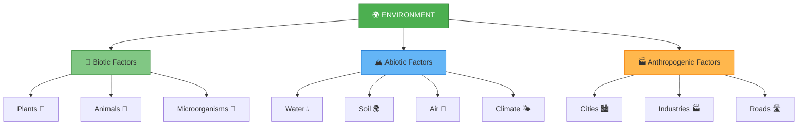

### 📚 Key Definitions

| Organization | Definition |
|-------------|------------|
| **UNESCO** | Environment is the complex of physical, chemical, biological, and social factors affecting individuals and communities |
| **General Scientific** | Everything around an organism, living or non-living, that influences its life processes |
| **Ecological** | The sum total of all conditions and influences that affect the development and life of organisms |

### 💡 Real-World Example
> **Marine Ecosystem**: A fish's environment includes:
> - 💧 **Abiotic**: Water temperature, pH, salinity, oxygen levels
> - 🌱 **Biotic**: Aquatic plants, other fish, plankton, bacteria  
> - 🏭 **Anthropogenic**: Fishing activities, pollution, boat traffic

---

### ✏️ Practice Questions

**Short Answer Questions:**
- **Q1.** Define environment in your own words.
- **Q2.** State the UNESCO definition of environment.
- **Q3.** Give two examples each of biotic and abiotic factors.

**MCQ:**
Which of the following is NOT a component of environment?
- [ ] A) Soil and rocks
- [ ] B) Plants and animals  
- [ ] C) Mathematical equations
- [ ] D) Human settlements

<details>
<summary>💡 <strong>Answer Key</strong></summary>

**Short Answers:**
1. Environment is the total surroundings including living and non-living factors that influence an organism's life.
2. Environment is the complex of physical, chemical, biological, and social factors affecting individuals and communities.
3. Biotic: Plants, Animals | Abiotic: Soil, Water

**MCQ:** C) Mathematical equations
</details>

---

## 🧩 Characteristics & Components

### 🎯 Key Characteristics

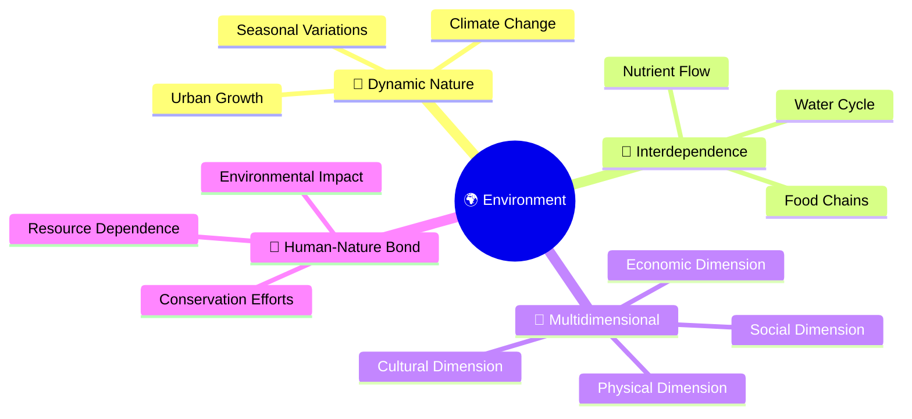

### 📊 Components Breakdown

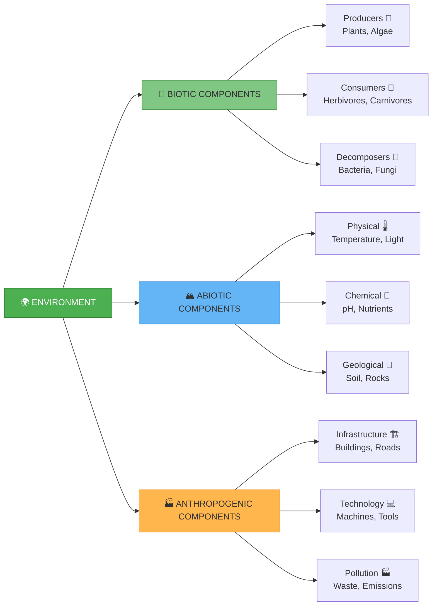

### 🔄 Component Interactions

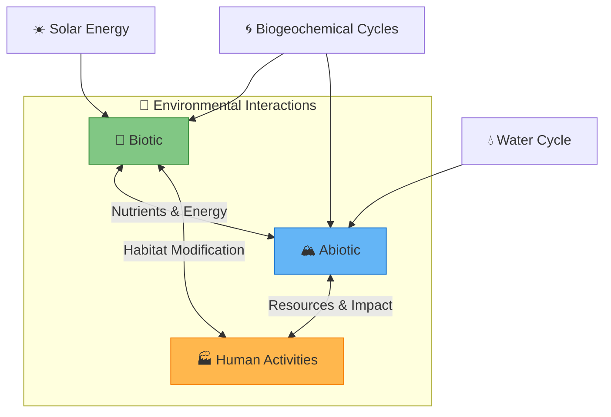

---

### ✏️ Practice Questions

**Short Answer Questions:**
- **Q1.** List three characteristics of environment with examples.
- **Q2.** Explain what is meant by "interdependence" in environment.
- **Q3.** Differentiate between biotic and abiotic components.

**MCQ:**
Which characteristic best describes environment's changing nature?
- [ ] A) Static
- [ ] B) Dynamic
- [ ] C) Uniform
- [ ] D) Simple

---

## 🌳 Types of Environment

### 🗺️ Classification Overview

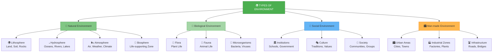

### 🌍 Natural Environment Spheres

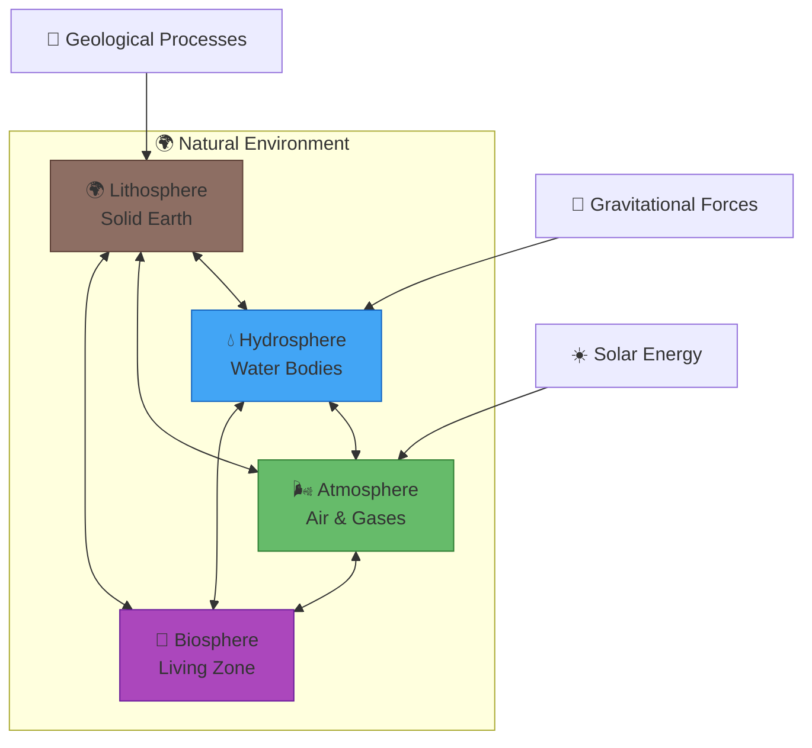

### 🏙️ Human Environment Types

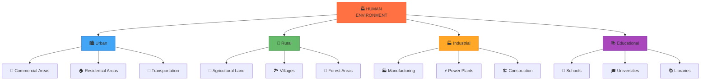

---

### ✏️ Practice Questions

**Short Answer Questions:**
- **Q1.** Name the four spheres of natural environment.
- **Q2.** Give two examples each of social and man-made environment.
- **Q3.** Distinguish between biological and social environment.

---

## 🔗 Interrelationships

### 🔄 Component Interconnections

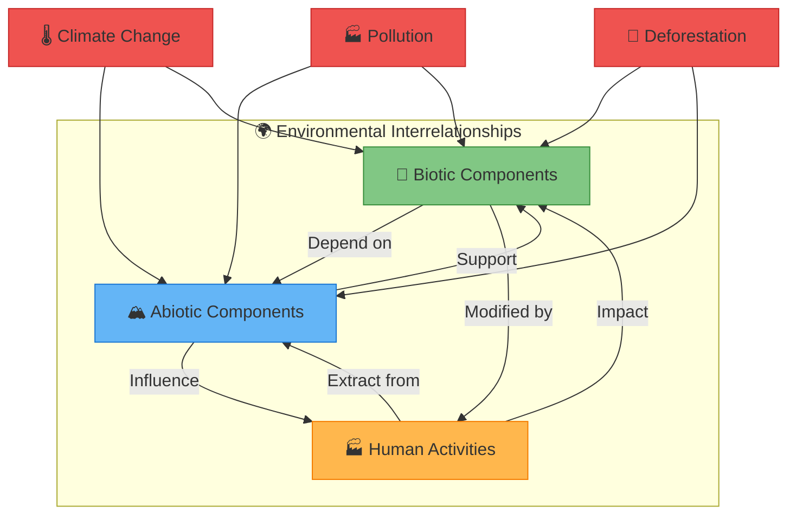

### 🌊 Cause-Effect Chain Example

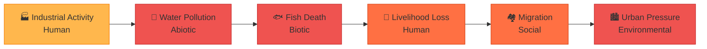

### ♻️ Natural Cycles Integration

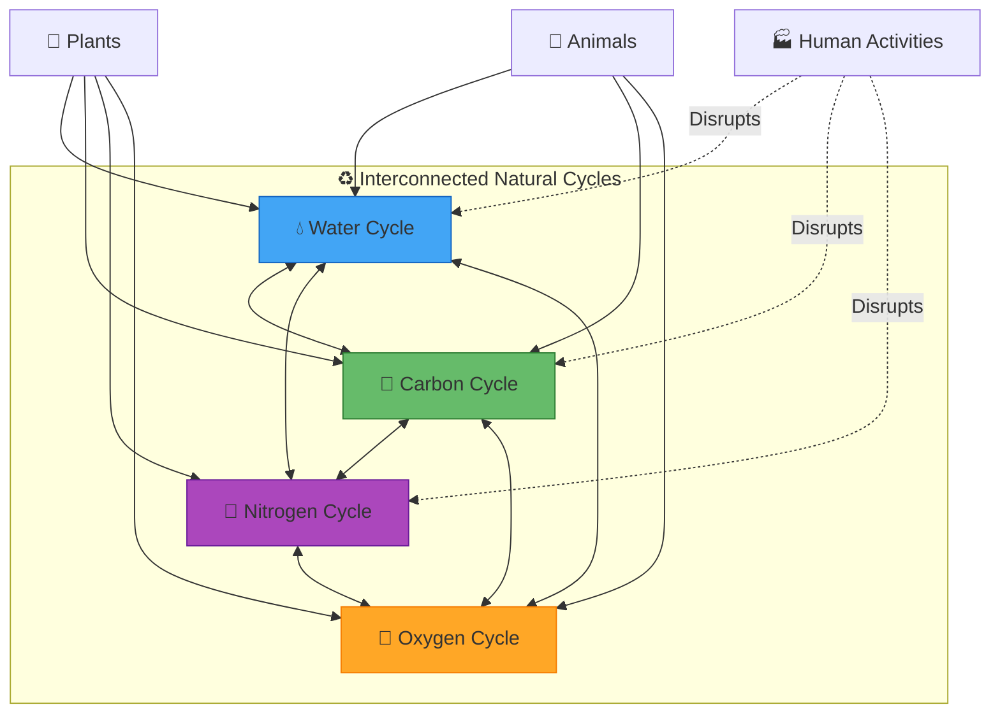

---

### ✏️ Practice Questions

**Short Answer Questions:**
- **Q1.** Explain one example of interrelationship between environmental components.
- **Q2.** How do human activities affect both biotic and abiotic factors?
- **Q3.** Describe the chain reaction caused by deforestation.

---

## 📐 Nature & Scope

### 🎯 Nature of Environmental Science

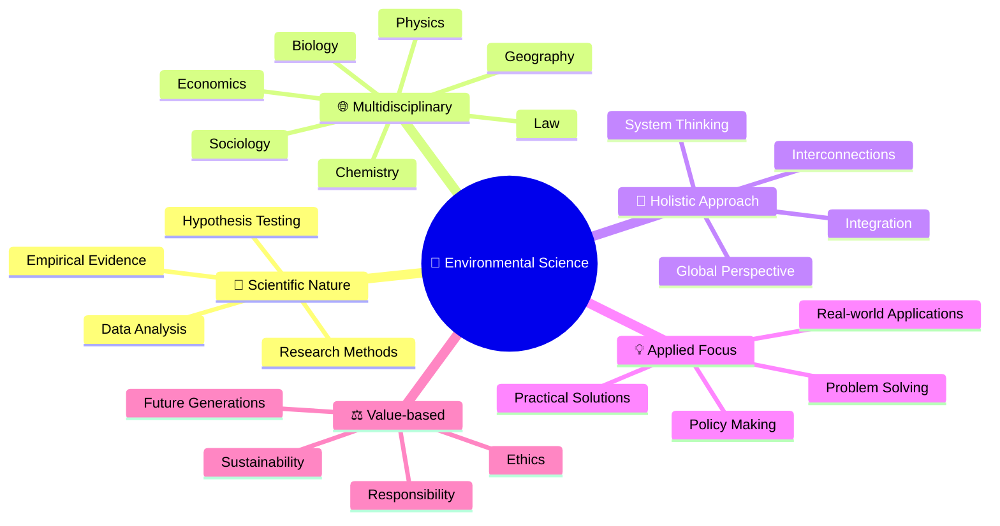

### 🎓 Scope Areas

```mermaid
graph TB
    A[🌍 SCOPE OF ENVIRONMENTAL SCIENCE] --> B[🌿 Natural Resources]
    A --> C[🦋 Ecology & Biodiversity]
    A --> D[🏭 Pollution Studies]
    A --> E[👥 Population Issues]
    A --> F[⚖️ Environmental Laws]
    A --> G[♻️ Sustainable Development]
    
    B --> B1[Water Resources 💧]
    B --> B2[Forest Resources 🌲]
    B --> B3[Mineral Resources ⛏️]
    B --> B4[Energy Resources ⚡]
    
    C --> C1[Species Diversity 🦋]
    C --> C2[Ecosystem Health 🌱]
    C --> C3[Conservation 🛡️]
    
    D --> D1[Air Pollution 🌫️]
    D --> D2[Water Pollution 🌊]
    D --> D3[Soil Pollution 🌍]
    D --> D4[Noise Pollution 🔊]
    
    E --> E1[Population Growth 📈]
    E --> E2[Resource Demand 📊]
    E --> E3[Urbanization 🏙️]
    
    F --> F1[Environmental Acts 📜]
    F --> F2[Regulations 📋]
    F --> F3[International Treaties 🌐]
    
    G --> G1[Green Technology 🔋]
    G --> G2[Renewable Energy ☀️]
    G --> G3[Circular Economy ♻️]
    
    style A fill:#4CAF50,stroke:#2E7D32,color:#fff
    style B fill:#81C784,stroke:#388E3C
    style C fill:#A5D6A7,stroke:#4CAF50
    style D fill:#EF5350,stroke:#C62828
    style E fill:#FF7043,stroke:#D84315
    style F fill:#64B5F6,stroke:#1976D2
    style G fill:#AB47BC,stroke:#6A1B9A
```

### 🔬 Interdisciplinary Connections

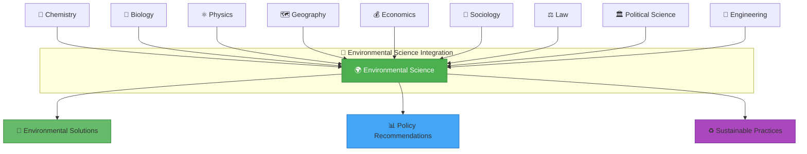

---

### ✏️ Practice Questions

**Short Answer Questions:**
- **Q1.** State four characteristics of environmental science.
- **Q2.** Name six areas covered under the scope of environmental science.
- **Q3.** Why is environmental science called multidisciplinary?

---

## ⭐ Importance & Case Studies

### 🌟 Why Environment Matters

```mermaid
graph TB
    A[⭐ IMPORTANCE OF ENVIRONMENT] --> B[🌱 Life Support System]
    A --> C[💰 Economic Foundation]
    A --> D[🎭 Cultural Heritage]
    A --> E[🌍 Global Stability]
    
    B --> B1[🌬️ Clean Air]
    B --> B2[💧 Fresh Water]  
    B --> B3[🍎 Food Supply]
    B --> B4[🌡️ Climate Regulation]
    
    C --> C1[🌾 Agriculture]
    C --> C2[🏭 Industries]
    C --> C3[🏖️ Tourism]
    C --> C4[⚡ Energy Production]
    
    D --> D1[🎪 Traditional Practices]
    D --> D2[🏛️ Sacred Sites]
    D --> D3[🎨 Art & Literature]
    D --> D4[🧘 Spiritual Values]
    
    E --> E1[🌡️ Climate Balance]
    E --> E2[🦋 Biodiversity]
    E --> E3[♻️ Resource Cycles]
    E --> E4[🌍 Ecosystem Services]
    
    style A fill:#FF9800,stroke:#E65100,color:#fff
    style B fill:#4CAF50,stroke:#2E7D32
    style C fill:#2196F3,stroke:#0D47A1
    style D fill:#9C27B0,stroke:#4A148C
    style E fill:#F44336,stroke:#B71C1C
```

### 📚 Important Case Studies

#### 🌫️ Delhi Air Pollution Crisis

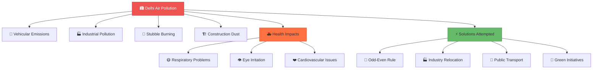

#### 🌲 Chipko Movement

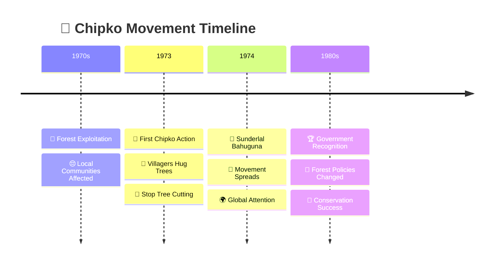

#### ☠️ Bhopal Gas Tragedy

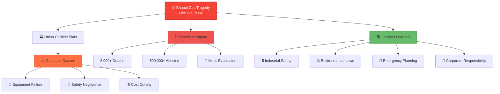

### 🌊 Environmental Disaster Impact Chain


---

### ✏️ Practice Questions

**Short Answer Questions:**
- **Q1.** State three reasons why environment is important for humans.
- **Q2.** Name any two environmental movements in India.
- **Q3.** What lessons were learned from the Bhopal Gas Tragedy?

**Case Study Question:**
- **Q4.** Analyze the causes and effects of Delhi's air pollution crisis.

---

## 🎓 Environmental Education Goals

### 🎯 Goals of Environmental Education

```mermaid
graph TB
    A[🎓 Environmental Education Goals] --> B[👁️ AWARENESS]
    A --> C[📚 KNOWLEDGE]
    A --> D[💭 ATTITUDES]
    A --> E[🔧 SKILLS]
    A --> F[🤝 PARTICIPATION]
    
    B --> B1[🌍 Environmental Issues]
    B --> B2[🚨 Current Problems]
    B --> B3[📊 Global Trends]
    
    C --> C1[🧠 Scientific Understanding]
    C --> C2[🔄 Natural Processes]  
    C --> C3[🏛️ Environmental Laws]
    
    D --> D1[💚 Pro-environment Values]
    D --> D2[🤲 Responsibility]
    D --> D3[🔮 Future Thinking]
    
    E --> E1[🔍 Problem Identification]
    E --> E2[💡 Solution Development]
    E --> E3[📊 Data Analysis]
    
    F --> F1[🌱 Individual Actions]
    F --> F2[👥 Community Involvement]
    F --> F3[📢 Advocacy]
    
    style A fill:#4CAF50,stroke:#2E7D32,color:#fff
    style B fill:#FF9800,stroke:#E65100
    style C fill:#2196F3,stroke:#0D47A1
    style D fill:#9C27B0,stroke:#4A148C
    style E fill:#F44336,stroke:#B71C1C
    style F fill:#607D8B,stroke:#263238
```

### 📊 Education Pathways

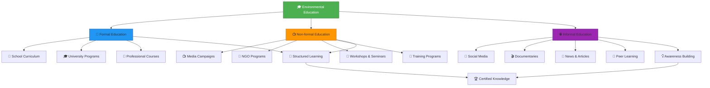

### 🇮🇳 Indian Government Initiatives

```mermaid
graph TB
    A[🇮🇳 Government Environmental Programs] --> B[🌱 National Green Corps]
    A --> C[🧹 Swachh Bharat Abhiyan]
    A --> D[🌍 Environment Day Celebrations]
    A --> E[📚 NCERT Green Curriculum]
    
    B --> B1[👦 School Children Focus]
    B --> B2[🌳 Tree Plantation]
    B --> B3[🌿 Biodiversity Awareness]
    
    C --> C1[🚮 Waste Management]
    C --> C2[🚽 Sanitation]
    C --> C3[👥 Community Participation]
    
    D --> D1[📅 June 5th Events]
    D --> D2[🏆 Award Programs]
    D --> D3[📢 Public Awareness]
    
    E --> E1[📖 Integrated Approach]
    E --> E2[🔬 Activity-based Learning]
    E --> E3[🌍 Local to Global Issues]
    
    style A fill:#FF9800,stroke:#E65100,color:#fff
    style B fill:#4CAF50,stroke:#2E7D32
    style C fill:#2196F3,stroke:#0D47A1
    style D fill:#9C27B0,stroke:#4A148C
    style E fill:#F44336,stroke:#B71C1C
```

### 🎯 Learning Progression

```mermaid
stateDiagram-v2
    [*] --> Awareness
    Awareness --> Knowledge: Information
    Knowledge --> Understanding: Learning
    Understanding --> Skills: Practice
    Skills --> Attitudes: Experience
    Attitudes --> Action: Motivation
    Action --> Participation: Engagement
    Participation --> Leadership: Growth
    Leadership --> [*]: Sustainability
```

---

### ✏️ Practice Questions

**Short Answer Questions:**
- **Q1.** List the five main goals of environmental education.
- **Q2.** Differentiate between formal and non-formal environmental education.
- **Q3.** Name three government programs for environmental awareness in India.

**Long Answer Question:**
- **Q4.** Explain how environmental education progresses from awareness to participation with examples.

---

## 📋 Unit I Summary

### 🎯 Key Concepts Recap

```mermaid
mindmap
  root((📚 Unit I Summary))
    🔍 Environment Definition
      Living + Non-living + Human-made
      UNESCO Definition
      Dynamic Nature
    🧩 Components
      Biotic Factors
      Abiotic Factors  
      Anthropogenic Factors
      Interdependence
    🌳 Types
      Natural Environment
      Biological Environment
      Social Environment
      Man-made Environment
    🔗 Interrelationships
      Component Interactions
      Cause-Effect Chains
      Natural Cycles
    📐 Nature & Scope
      Multidisciplinary Science
      Holistic Approach
      Applied Focus
      Wide Scope Areas
    ⭐ Importance
      Life Support System
      Economic Foundation
      Cultural Heritage
      Case Studies
    🎓 Education
      Five Main Goals
      Formal & Non-formal
      Government Programs
```

### 📝 Quick Reference Table

| Topic | Key Points | Examples |
|-------|------------|----------|
| **🔍 Definition** | Sum of all factors affecting life | Fish environment: water, plants, pollution |
| **🧩 Components** | Biotic, Abiotic, Anthropogenic | Plants, Soil, Cities |
| **🌳 Types** | Natural, Biological, Social, Man-made | Lithosphere, Flora, Culture, Urban |
| **🔗 Relations** | All components interconnected | Deforestation → Soil erosion → Habitat loss |
| **📐 Nature** | Multidisciplinary, Holistic, Applied | Biology + Chemistry + Economics |
| **⭐ Importance** | Life support, Economy, Culture | Clean air, Agriculture, Traditions |
| **🎓 Education** | Awareness → Knowledge → Action | School programs, Media campaigns |

### 🏆 Important Case Studies to Remember

- **🌫️ Delhi Air Pollution**: Urban environmental crisis
- **🌲 Chipko Movement**: People's forest conservation effort  
- **☠️ Bhopal Gas Tragedy**: Industrial disaster lessons

---

# Unit II — Natural Resources

## 🌊 Water Resources

### 💧 Water: The Universal Solvent

Water is Earth's most precious resource, covering 71% of the planet's surface but with less than 3% being freshwater suitable for human consumption.

```mermaid
pie title 🌍 Earth's Water Distribution
    "Oceans (97.2%)" : 97.2
    "Ice Caps & Glaciers (2.15%)" : 2.15
    "Groundwater (0.61%)" : 0.61
    "Surface Water (0.009%)" : 0.009
    "Atmosphere (0.001%)" : 0.001
```

### 💧 The Water Cycle

```mermaid
graph TB
    A[☀️ Solar Energy] --> B[💨 Evaporation]
    B --> C[☁️ Cloud Formation]
    C --> D[🌧️ Precipitation]
    D --> E[🏔️ Surface Runoff]
    D --> F[💧 Infiltration]
    E --> G[🌊 Rivers & Lakes]
    F --> H[💎 Groundwater]
    G --> I[🌊 Ocean]
    H --> I
    I --> B
    
    J[🌱 Transpiration] --> C
    K[🏠 Human Use] --> G
    K --> H
    
    style A fill:#FFD54F,stroke:#F57C00
    style B fill:#81D4FA,stroke:#0277BD
    style C fill:#E1F5FE,stroke:#0277BD
    style D fill:#4FC3F7,stroke:#0277BD
    style I fill:#1976D2,stroke:#0D47A1,color:#fff
```

### 🚰 Water Resource Classification

```mermaid
graph TB
    A[💧 WATER RESOURCES] --> B[🏔️ Surface Water]
    A --> C[💎 Groundwater]
    A --> D[🌧️ Atmospheric Water]
    
    B --> B1[🌊 Rivers]
    B --> B2[🏞️ Lakes]
    B --> B3[🌊 Reservoirs]
    B --> B4[💧 Streams]
    
    C --> C1[💧 Aquifers]
    C --> C2[💎 Water Table]
    C --> C3[⛲ Springs]
    C --> C4[🕳️ Wells]
    
    D --> D1[🌧️ Rainfall]
    D --> D2[❄️ Snow]
    D --> D3[🌫️ Fog Harvesting]
    
    style A fill:#2196F3,stroke:#0D47A1,color:#fff
    style B fill:#64B5F6,stroke:#1976D2
    style C fill:#81C784,stroke:#388E3C
    style D fill:#E1F5FE,stroke:#0277BD
```

### 🏭 Water Usage Sectors

```mermaid
pie title 🚰 Global Water Usage
    "Agriculture (70%)" : 70
    "Industry (20%)" : 20
    "Domestic (10%)" : 10
```

### 💧 Water Problems & Solutions

```mermaid
graph TB
    A[🚨 WATER PROBLEMS] --> B[💧 Scarcity]
    A --> C[🏭 Pollution] 
    A --> D[🌊 Floods]
    A --> E[🏜️ Droughts]
    
    B --> F[💡 SOLUTIONS]
    C --> F
    D --> F
    E --> F
    
    F --> G[💧 Water Harvesting]
    F --> H[♻️ Water Treatment]
    F --> I[💧 Conservation]
    F --> J[🌊 Watershed Management]
    
    G --> G1[🏠 Rooftop Collection]
    H --> H1[🏭 Wastewater Treatment]
    I --> I1[💧 Drip Irrigation]
    J --> J1[🌲 Forest Protection]
    
    style A fill:#F44336,stroke:#B71C1C,color:#fff
    style F fill:#4CAF50,stroke:#2E7D32,color:#fff
```

---

### ✏️ Practice Questions

**Short Answer Questions:**
- **Q1.** What percentage of Earth's water is freshwater?
- **Q2.** Name four sources of surface water.
- **Q3.** List three methods of water conservation.

---

## 🌲 Forest Resources

### 🌳 Forests: Earth's Lungs

Forests cover approximately 31% of Earth's land surface and are home to 80% of terrestrial biodiversity.

```mermaid
graph TB
    A[🌲 FOREST TYPES] --> B[🌲 Tropical Forests]
    A --> C[🍂 Temperate Forests]
    A --> D[❄️ Boreal Forests]
    A --> E[🌿 Grassland Forests]
    
    B --> B1[🌿 Tropical Rainforest]
    B --> B2[🌳 Tropical Deciduous]
    B --> B3[🏜️ Tropical Dry Forest]
    
    C --> C1[🍂 Deciduous]
    C --> C2[🌲 Coniferous]
    C --> C3[🌿 Mixed Forest]
    
    D --> D1[🌲 Taiga/Coniferous]
    D --> D2[❄️ Subarctic]
    
    E --> E1[🌾 Savanna]
    E --> E2[🌿 Woodland]
    
    style A fill:#4CAF50,stroke:#2E7D32,color:#fff
    style B fill:#81C784,stroke:#388E3C
    style C fill:#FFC107,stroke:#F57C00
    style D fill:#607D8B,stroke:#263238
    style E fill:#8BC34A,stroke:#558B2F
```

### 🌍 Forest Functions

```mermaid
mindmap
  root((🌲 Forest Functions))
    🌬️ Environmental
      Oxygen Production
      Carbon Sequestration
      Climate Regulation
      Water Cycle
      Soil Conservation
    💰 Economic
      Timber Production
      Non-timber Products
      Employment
      Tourism Revenue
      Medicinal Plants
    🦋 Ecological
      Biodiversity Habitat
      Food Chains
      Nutrient Cycling
      Ecosystem Services
    👥 Social
      Tribal Communities
      Cultural Values
      Recreation
      Aesthetic Value
      Spiritual Significance
```

### 🪓 Deforestation Causes & Effects

```mermaid
flowchart LR
    subgraph "🪓 Deforestation Causes"
    A[🏭 Agriculture Expansion]
    B[🪵 Logging]
    C[🏙️ Urbanization]
    D[🔥 Forest Fires]
    E[🐄 Cattle Ranching]
    end
    
    subgraph "📉 Effects"
    F[🌡️ Climate Change]
    G[🦋 Biodiversity Loss]  
    H[🌊 Soil Erosion]
    I[💧 Water Scarcity]
    J[🌪️ Natural Disasters]
    end
    
    A --> F
    B --> G
    C --> H
    D --> I
    E --> J
    A --> G
    B --> F
    C --> I
    
    style A fill:#FF7043,stroke:#D84315
    style B fill:#FF7043,stroke:#D84315
    style C fill:#FF7043,stroke:#D84315
    style D fill:#FF7043,stroke:#D84315
    style E fill:#FF7043,stroke:#D84315
    style F fill:#EF5350,stroke:#C62828
    style G fill:#EF5350,stroke:#C62828
    style H fill:#EF5350,stroke:#C62828
    style I fill:#EF5350,stroke:#C62828
    style J fill:#EF5350,stroke:#C62828
```

### 🛡️ Forest Conservation Strategies

```mermaid
graph TB
    A[🛡️ FOREST CONSERVATION] --> B[🏞️ Protected Areas]
    A --> C[🌱 Afforestation]
    A --> D[♻️ Sustainable Management]
    A --> E[👥 Community Participation]
    
    B --> B1[🏞️ National Parks]
    B --> B2[🦋 Wildlife Sanctuaries]
    B --> B3[🌲 Biosphere Reserves]
    
    C --> C1[🌱 Tree Plantation]
    C --> C2[🌿 Reforestation]
    C --> C3[🌳 Agroforestry]
    
    D --> D1[🪵 Selective Logging]
    D --> D2[♻️ Forest Certification]
    D --> D3[⏰ Rotation Systems]
    
    E --> E1[👥 Joint Forest Management]
    E --> E2[🏛️ Traditional Knowledge]
    E --> E3[💰 Economic Incentives]
    
    style A fill:#4CAF50,stroke:#2E7D32,color:#fff
    style B fill:#81C784,stroke:#388E3C
    style C fill:#A5D6A7,stroke:#4CAF50
    style D fill:#66BB6A,stroke:#2E7D32
    style E fill:#8BC34A,stroke:#558B2F
```

---

### ✏️ Practice Questions

**Short Answer Questions:**
- **Q1.** What percentage of Earth's land is covered by forests?
- **Q2.** Name three types of forest based on climate.
- **Q3.** List four environmental functions of forests.

---

## ⚡ Energy Resources

### 🔋 Energy Classification

```mermaid
graph TB
    A[⚡ ENERGY RESOURCES] --> B[♻️ Renewable]
    A --> C[⛽ Non-renewable]
    
    B --> B1[☀️ Solar Energy]
    B --> B2[💨 Wind Energy]
    B --> B3[💧 Hydro Energy]
    B --> B4[🌍 Geothermal]
    B --> B5[🌿 Biomass]
    B --> B6[🌊 Tidal Energy]
    
    C --> C1[⚫ Coal]
    C --> C2[🛢️ Petroleum]
    C --> C3[💨 Natural Gas]
    C --> C4[⚛️ Nuclear Energy]
    
    style A fill:#FF9800,stroke:#E65100,color:#fff
    style B fill:#4CAF50,stroke:#2E7D32
    style C fill:#F44336,stroke:#B71C1C
```

### ☀️ Renewable Energy Sources

```mermaid
graph TB
    subgraph "☀️ Solar Energy"
    A[☀️ Solar Power] --> A1[🏠 Photovoltaic Cells]
    A --> A2[🌡️ Solar Thermal]
    A --> A3[☀️ Solar Cookers]
    end
    
    subgraph "💨 Wind Energy"  
    B[💨 Wind Power] --> B1[⚡ Wind Turbines]
    B --> B2[💨 Wind Farms]
    B --> B3[🌊 Offshore Wind]
    end
    
    subgraph "💧 Hydro Energy"
    C[💧 Hydropower] --> C1[🏔️ Large Dams]
    C --> C2[💧 Small Hydro]
    C --> C3[🌊 Pumped Storage]
    end
    
    style A fill:#FFD54F,stroke:#F57C00
    style B fill:#81D4FA,stroke:#0277BD
    style C fill:#4FC3F7,stroke:#0288D1
```

### 🛢️ Fossil Fuel Formation & Issues

```mermaid
timeline
    title 🛢️ Fossil Fuel Formation Timeline
    
    Millions of Years Ago : 🌿 Ancient Plants & Animals Die
                          : 🏔️ Buried Under Sediments
    
    Over Time : 🌡️ Heat & Pressure Applied
             : ⚫ Organic Matter Transforms
    
    Today : ⚫ Coal Formation
          : 🛢️ Oil & Gas Deposits
          : ⛏️ Extraction & Use
    
    Future : 📉 Resources Depleting
           : 🌡️ Climate Change Issues
           : ♻️ Shift to Renewables
```

### 🌍 Energy Consumption Patterns

```mermaid
pie title 🔋 Global Energy Consumption by Source
    "Oil (33%)" : 33
    "Coal (27%)" : 27
    "Natural Gas (24%)" : 24
    "Hydro (7%)" : 7
    "Nuclear (4%)" : 4
    "Renewables (5%)" : 5
```

### ♻️ Sustainable Energy Future

```mermaid
graph TB
    A[♻️ SUSTAINABLE ENERGY FUTURE] --> B[🔋 Energy Efficiency]
    A --> C[☀️ Renewable Expansion]
    A --> D[🔋 Energy Storage]
    A --> E[🌐 Smart Grids]
    
    B --> B1[💡 LED Lighting]
    B --> B2[🏠 Building Insulation]  
    B --> B3[⚡ Efficient Appliances]
    
    C --> C1[☀️ Solar Farms]
    C --> C2[💨 Wind Parks]
    C --> C3[🌿 Biomass Plants]
    
    D --> D1[🔋 Battery Technology]
    D --> D2[💧 Pumped Storage]
    D --> D3[🌍 Compressed Air]
    
    E --> E1[📊 Smart Meters]
    E --> E2[🤖 AI Management]
    E --> E3[🔌 Grid Integration]
    
    style A fill:#4CAF50,stroke:#2E7D32,color:#fff
    style B fill:#FF9800,stroke:#E65100
    style C fill:#8BC34A,stroke:#558B2F
    style D fill:#2196F3,stroke:#0D47A1
    style E fill:#9C27B0,stroke:#4A148C
```

---

### ✏️ Practice Questions

**Short Answer Questions:**
- **Q1.** Differentiate between renewable and non-renewable energy resources.
- **Q2.** Name three advantages of solar energy.
- **Q3.** Why is energy conservation important?

---

## 🏔️ Mineral Resources

### ⛏️ Mineral Classification

```mermaid
graph TB
    A[⛏️ MINERAL RESOURCES] --> B[🏭 Metallic Minerals]
    A --> C[🧱 Non-metallic Minerals]
    A --> D[⚡ Energy Minerals]
    
    B --> B1[⚫ Ferrous]
    B --> B2[🟡 Non-ferrous]
    B1 --> B3[🔩 Iron Ore]
    B1 --> B4[⚪ Manganese]  
    B2 --> B5[🟡 Gold]
    B2 --> B6[🔴 Copper]
    B2 --> B7[⚪ Silver]
    B2 --> B8[🟢 Zinc]
    
    C --> C1[🧱 Construction]
    C --> C2[🧪 Industrial]
    C1 --> C3[🪨 Limestone]
    C1 --> C4[🏔️ Granite]
    C2 --> C5[⚪ Salt]
    C2 --> C6[🟫 Clay]
    
    D --> D1[⚫ Coal]
    D --> D2[🛢️ Petroleum]
    D --> D3[⚛️ Uranium]
    
    style A fill:#795548,stroke:#3E2723,color:#fff
    style B fill:#FF9800,stroke:#E65100
    style C fill:#607D8B,stroke:#263238
    style D fill:#F44336,stroke:#B71C1C
```

### 🌍 Mineral Distribution & Mining

```mermaid
graph TB
    A[⛏️ MINING METHODS] --> B[🕳️ Surface Mining]
    A --> C[🌍 Underground Mining]
    
    B --> B1[⛏️ Open Pit]
    B --> B2[🏔️ Strip Mining]
    B --> B3[🏜️ Placer Mining]
    B --> B4[🚜 Quarrying]
    
    C --> C1[🚇 Shaft Mining]
    C --> C2[🏔️ Slope Mining]
    C --> C3[🌊 Solution Mining]
    
    A --> D[🌍 Environmental Impact]
    D --> D1[🌊 Water Pollution]
    D --> D2[🌬️ Air Pollution]
    D --> D3[🏔️ Land Degradation]
    D --> D4[🦋 Habitat Destruction]
    
    style A fill:#795548,stroke:#3E2723,color:#fff
    style B fill:#FFC107,stroke:#F57C00
    style C fill:#607D8B,stroke:#263238
    style D fill:#F44336,stroke:#B71C1C
```

### ♻️ Mineral Conservation

```mermaid
flowchart TD
    A[♻️ MINERAL CONSERVATION] --> B[♻️ Recycling]
    A --> C[🔄 Substitution]
    A --> D[⚡ Efficiency]
    A --> E[🌿 Reduce Consumption]
    
    B --> B1[🚗 Metal Recycling]
    B --> B2[🏗️ Construction Materials]
    B --> B3[📱 E-waste Recovery]
    
    C --> C1[🪨 Alternative Materials]
    C --> C2[🧪 Synthetic Substitutes]
    C --> C3[🌿 Bio-materials]
    
    D --> D1[⚡ Better Technology]
    D --> D2[🔧 Improved Processes]
    D --> D3[📊 Waste Reduction]
    
    E --> E1[👥 Consumer Awareness]
    E --> E2[🏛️ Policy Changes]
    E --> E3[🌍 Sustainable Practices]
    
    style A fill:#4CAF50,stroke:#2E7D32,color:#fff
    style B fill:#2196F3,stroke:#0D47A1
    style C fill:#FF9800,stroke:#E65100
    style D fill:#9C27B0,stroke:#4A148C
    style E fill:#607D8B,stroke:#263238
```

---

### ✏️ Practice Questions

**Short Answer Questions:**
- **Q1.** Classify minerals into three main categories with examples.
- **Q2.** What are the environmental impacts of mining?
- **Q3.** Suggest four methods of mineral conservation.

---

## 📋 Unit II Summary

### 🎯 Natural Resources Overview

```mermaid
mindmap
  root((🌍 Natural Resources))
    💧 Water Resources
      Surface Water
      Groundwater
      Water Cycle
      Conservation Methods
    🌲 Forest Resources
      Forest Types
      Functions
      Deforestation Issues
      Conservation Strategies
    ⚡ Energy Resources
      Renewable Sources
      Non-renewable Sources
      Energy Conservation
      Sustainable Future
    ⛏️ Mineral Resources
      Metallic Minerals
      Non-metallic Minerals
      Mining Methods
      Conservation Practices
```

---

# Unit III — Ecosystem & Biodiversity

## 🌱 Introduction to Ecology

### 🔬 Ecological Hierarchy

```mermaid
graph TB
    A[🌍 ECOLOGICAL ORGANIZATION] --> B[👤 Individual]
    B --> C[👥 Population]
    C --> D[🦋 Community]
    D --> E[🌳 Ecosystem]
    E --> F[🌍 Biome]
    F --> G[🌎 Biosphere]
    
    H[🦁 Single Lion] --> B
    I[🦁 Pride of Lions] --> C
    J[🦁 Lions + 🦓 Zebras + 🌿 Grass] --> D
    K[🏞️ Savanna with all interactions] --> E
    L[🌍 All Tropical Grasslands] --> F
    M[🌎 All Life on Earth] --> G
    
    style A fill:#4CAF50,stroke:#2E7D32,color:#fff
    style G fill:#2196F3,stroke:#0D47A1,color:#fff
    style F fill:#8BC34A,stroke:#558B2F
    style E fill:#66BB6A,stroke:#2E7D32
    style D fill:#A5D6A7,stroke:#4CAF50
```

### 🌿 Ecosystem Components

```mermaid
graph TB
    A[🌳 ECOSYSTEM] --> B[🌱 Biotic Components]
    A --> C[🏔️ Abiotic Components]
    
    B --> D[🌿 Producers]
    B --> E[🦋 Primary Consumers]
    B --> F[🦁 Secondary Consumers]
    B --> G[🦅 Tertiary Consumers]
    B --> H[🍄 Decomposers]
    
    C --> I[☀️ Light]
    C --> J[🌡️ Temperature]
    C --> K[💧 Water]
    C --> L[🌬️ Air]
    C --> M[🌍 Soil]
    C --> N[🧪 Nutrients]
    
    D --> O[🌿 Green Plants]
    E --> P[🦌 Herbivores]
    F --> Q[🐺 Carnivores]
    G --> R[🦅 Top Predators]
    H --> S[🍄 Bacteria & Fungi]
    
    style A fill:#4CAF50,stroke:#2E7D32,color:#fff
    style B fill:#81C784,stroke:#388E3C
    style C fill:#64B5F6,stroke:#1976D2
```

---

## 🔄 Energy Flow & Food Chains

### 🌿 Food Chain Structure

```mermaid
flowchart LR
    A[☀️ Solar Energy] --> B[🌿 Producers<br/>Plants]
    B --> C[🦌 Primary Consumers<br/>Herbivores]
    C --> D[🐺 Secondary Consumers<br/>Carnivores]
    D --> E[🦅 Tertiary Consumers<br/>Top Predators]
    
    B --> F[🍄 Decomposers]
    C --> F
    D --> F
    E --> F
    F --> G[🌍 Soil Nutrients]
    G --> B
    
    style A fill:#FFD54F,stroke:#F57C00
    style B fill:#81C784,stroke:#388E3C
    style C fill:#FF9800,stroke:#E65100
    style D fill:#F44336,stroke:#B71C1C
    style E fill:#9C27B0,stroke:#4A148C
    style F fill:#795548,stroke:#3E2723
```

### 🕸️ Food Web Complexity

```mermaid
graph TB
    subgraph "🕸️ Complex Food Web"
    A[🌿 Grass] --> B[🦌 Deer]
    A --> C[🐭 Mouse]
    A --> D[🦗 Grasshopper]
    
    B --> E[🐺 Wolf]
    C --> F[🐍 Snake]
    C --> G[🦅 Hawk]
    D --> H[🐸 Frog]
    D --> G
    
    F --> G
    H --> F
    
    I[🌰 Seeds] --> C
    I --> J[🐿️ Squirrel]
    J --> G
    
    K[🍄 Decomposers] --> A
    K --> I
    end
    
    style A fill:#81C784,stroke:#388E3C
    style E fill:#F44336,stroke:#B71C1C
    style G fill:#9C27B0,stroke:#4A148C
    style K fill:#795548,stroke:#3E2723
```

### ⚡ Energy Pyramid

```mermaid
graph TB
    subgraph "⚡ Energy Transfer (10% Rule)"
    A[🦅 Tertiary Consumers<br/>1 kcal]
    B[🐺 Secondary Consumers<br/>10 kcal]
    C[🦌 Primary Consumers<br/>100 kcal]
    D[🌿 Producers<br/>1000 kcal]
    E[☀️ Solar Energy<br/>10,000 kcal]
    end
    
    E --> D
    D --> C
    C --> B
    B --> A
    
    style E fill:#FFD54F,stroke:#F57C00
    style D fill:#81C784,stroke:#388E3C
    style C fill:#FF9800,stroke:#E65100
    style B fill:#F44336,stroke:#B71C1C
    style A fill:#9C27B0,stroke:#4A148C
```

---

## ♻️ Biogeochemical Cycles

### 💧 Water Cycle

```mermaid
graph TB
    A[🌊 Ocean] --> B[💨 Evaporation]
    B --> C[☁️ Clouds]
    C --> D[🌧️ Precipitation]
    D --> E[🏔️ Surface Runoff]
    D --> F[🌱 Plant Uptake]
    E --> A
    F --> G[💨 Transpiration]
    G --> C
    D --> H[💎 Groundwater]
    H --> A
    
    style A fill:#2196F3,stroke:#0D47A1,color:#fff
    style B fill:#81D4FA,stroke:#0277BD
    style C fill:#E1F5FE,stroke:#0277BD
    style D fill:#4FC3F7,stroke:#0277BD
```

### 🌿 Carbon Cycle

```mermaid
graph TB
    A[🌬️ Atmospheric CO₂] --> B[🌱 Photosynthesis]
    B --> C[🌿 Plant Carbon]
    C --> D[🦌 Animal Carbon]
    D --> E[💨 Respiration]
    E --> A
    C --> F[🍄 Decomposition]
    F --> A
    G[🏭 Fossil Fuel Burning] --> A
    H[🌊 Ocean] <--> A
    I[🏔️ Rocks] --> A
    
    style A fill:#E0E0E0,stroke:#424242
    style B fill:#81C784,stroke:#388E3C
    style G fill:#F44336,stroke:#B71C1C
    style H fill:#2196F3,stroke:#0D47A1
```

### 🍃 Nitrogen Cycle

```mermaid
graph TB
    A[🌬️ Atmospheric N₂] --> B[⚡ Nitrogen Fixation]
    B --> C[🌱 Plant Proteins]
    C --> D[🦌 Animal Proteins]
    D --> E[💩 Waste/Death]
    E --> F[🦠 Decomposition]
    F --> G[💧 Ammonia NH₃]
    G --> H[🦠 Nitrification]
    H --> I[💧 Nitrites NO₂⁻]
    I --> J[💧 Nitrates NO₃⁻]
    J --> C
    J --> K[🦠 Denitrification]
    K --> A
    
    style A fill:#E3F2FD,stroke:#1976D2
    style B fill:#FFC107,stroke:#F57C00
    style C fill:#81C784,stroke:#388E3C
```

---

## 🦋 Biodiversity

### 🌍 Types of Biodiversity

```mermaid
graph TB
    A[🦋 BIODIVERSITY] --> B[🧬 Genetic Diversity]
    A --> C[🌿 Species Diversity]
    A --> D[🌍 Ecosystem Diversity]
    
    B --> B1[🧬 Within Species Variation]
    B --> B2[🎭 Different Breeds/Varieties]
    B --> B3[🔬 Genetic Adaptation]
    
    C --> C1[🦋 Species Richness]
    C --> C2[⚖️ Species Evenness]
    C --> C3[