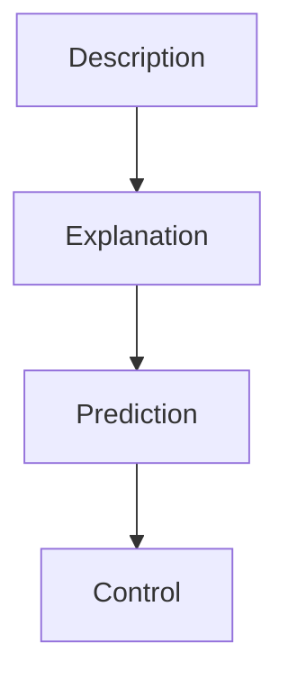
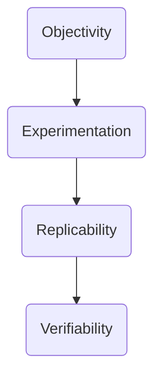
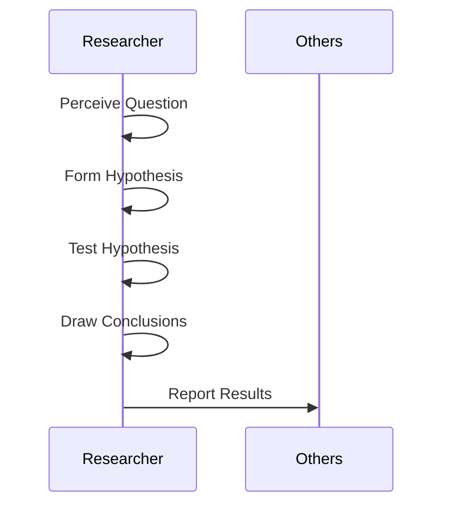

Welcome, explorer of the mind 🧠!  
This first unit sets the stage for everything else. Let’s walk through the **roots, goals, and methods** of psychology like detectives uncovering the secrets of behavior.

---

## 🌱 Meaning & Definition

Psychology = **scientific study of behavior and mental processes**.  
- *“Psyche” = soul/mind, “Logos” = study.*  
- First psychology lab: **Wilhelm Wundt, 1879, Leipzig (Germany)**.  

:::tip Quick Hindi Recap
Psychology = vyavhar aur mansik prakriyaon ka vigyaan.  
1879 mein Wilhelm Wundt ne Leipzig (Germany) mein pehli lab sthapit ki.
:::

---

## 🏛 Origins

- Greek roots: Psyche + Logos.  
- Early psychology = mind; modern psychology = mind + behavior.  
- **Wundt (1879)** = “Father of modern psychology.”  

---

## 📖 Key Definitions

| Author  | Definition |
|---------|------------|
| Morgan (1986) | Science of human & animal behavior |
| Feldman (1996) | Study of behavior and mental processes |
| Baron (1999)   | Science of behavior & cognitive processes |

---

## 🎯 Four Major Goals

---

🔬 Psychology as a Science

Core features of science:

    Objectivity – no bias.

    Experimentation – controlled testing.

    Replicability – repeatable results.

    Verifiability – results can be checked.

---

🧑‍🔬 Steps in Scientific Method

---
✨ Unit I Recap

    Psychology = study of behavior & mental processes.

    Wundt founded first psychology lab in 1879.

    Goals = Description, Explanation, Prediction, Control.

    Psychology is a science → Objectivity, Experimentation, Replicability, Verifiability.

    Scientific Method = Question → Hypothesis → Test → Conclusion → Report.

Think of psychology as a compass 🧭 — it helps us describe, explain, predict, and sometimes even control human behavior.
