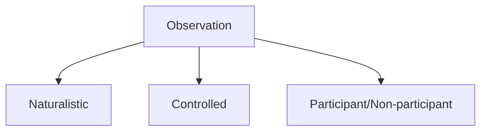
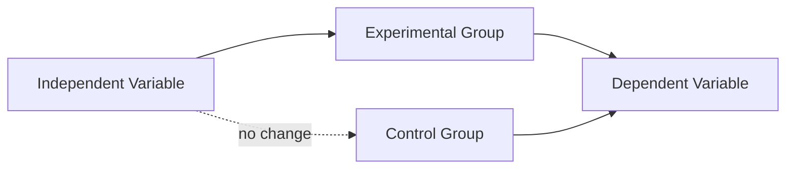

# 📘 Unit 3 – Methods of Psychology

Time to roll up our sleeves 🧑‍🔬!  
Psychology doesn’t just talk about behavior — it **studies** it with powerful tools. Let’s explore the **methods**.

---

## 🪞 Introspection

- Looking inward, analyzing one’s own thoughts/feelings.  
- Key figures: **Wundt & Titchener**.  
- Limitation → highly **subjective**.  

---

## 👀 Observation

- **Naturalistic** – watching in real-world settings.  
- **Controlled** – observing in labs.  
- Types: **Participant** vs **Non-participant**.  

---

## 📝 Survey

- Tools: **questionnaires & interviews**.  
- Pros → large data, quick results.  
- Cons → sampling bias, inaccuracies.  

---

## ⚗️ Experimental Method

- Manipulate **Independent Variable (IV)**.  
- Measure **Dependent Variable (DV)**.  
- Compare **Control vs Experimental Groups**.  

---

## 📚 Case Study

- Deep study of a single person/group.  
- Example: Freud’s famous patient cases.  
- Limitation → cannot generalize.  

---

## 🔗 Correlational Method

- Measures relationship between two variables.  
- **r = -1.00 → +1.00** (strength & direction).  
- Shows relation, but **not causation**.  

---

### ✨ Unit III Recap

- **Methods** = Introspection, Observation, Survey, Experiment, Case Study, Correlation.  
- **Best for science** → Experimental.  
- **Best for depth** → Case Study.  
- **Best for quick insights** → Survey.  

Each method is like a **different lens 🔍** — switch them to get new perspectives on human behavior.

