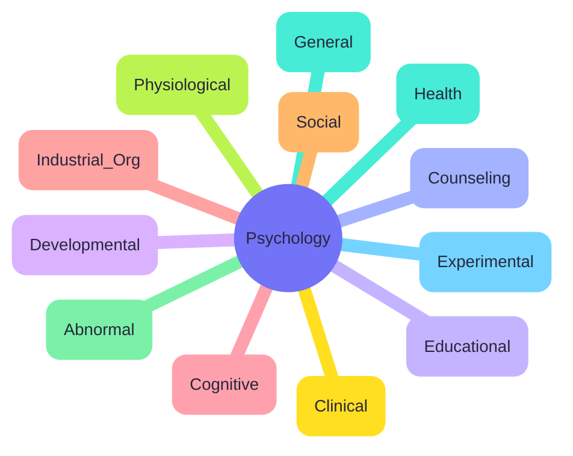

# 📘 Unit 2 – Scope of Psychology

Now that we know *what psychology is*, let’s see **where it can go**.  
Psychology is like a tree 🌳 — it has many **branches**, each exploring different aspects of human behavior.

---

## 🌿 Branches of Psychology

| Branch | Focus Area |
|--------|------------|
| General | Basic principles of behavior |
| Social | Group behavior, attitudes |
| Developmental | Growth across lifespan |
| Abnormal | Disorders, mental illness |
| Educational | Learning & teaching methods |
| Industrial/Organizational | Workplace behavior |
| Clinical | Diagnosis & treatment of disorders |
| Counseling | Guidance & problem-solving |
| Physiological | Brain, nervous system |
| Experimental | Controlled experiments |
| Cognitive | Thinking, memory, perception |
| Health | Mind-body relationship |

---

🌎 Applications of Psychology

Education → better teaching & learning.

Health → coping with stress, building resilience.

Industry → productivity & leadership.

Sports → enhancing performance.

Environment → promoting eco-friendly behavior.

Law & Forensics → criminal profiling, eyewitness accuracy.

:::tip Remember
Psychology isn’t just theory — it’s everywhere: in classrooms, hospitals, offices, stadiums, and even courtrooms!
:::

✨ Unit II Recap

Psychology = multi-branch discipline.

12+ branches (from Clinical to Health).

Applications reach education, health, industry, sports, environment, and law.

Imagine psychology as a Swiss Army knife 🔧 — versatile, adaptable, and useful in countless real-world contexts.