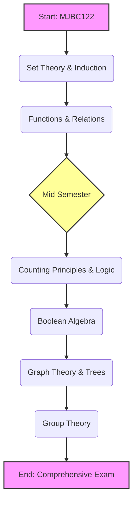
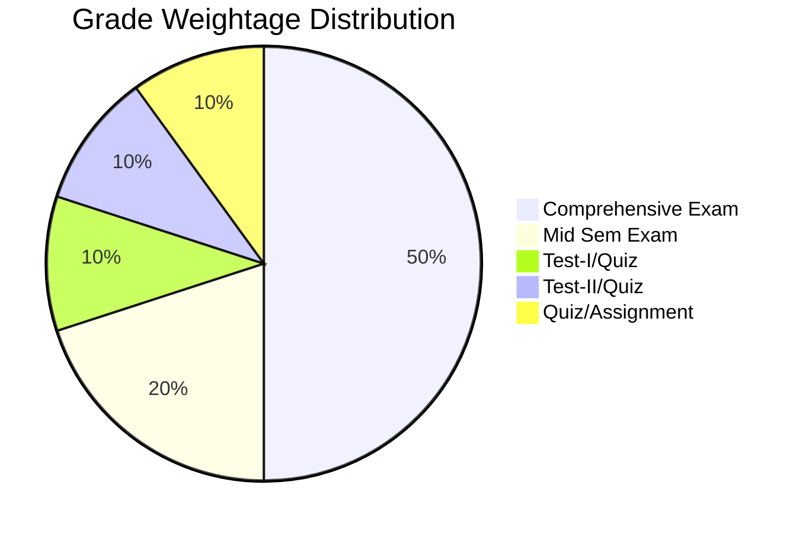

:::info Quick Navigation
- [📘 Course Overview](#-course-overview)
- [👨‍🏫 Instructor Information](#-instructor-information)
- [🎯 Objectives & Outcomes](#-objectives--outcomes)
- [🧭 Visual Roadmap](#-visual-roadmap)
- [📅 Lecture-wise Plan](#-lecture-wise-plan)
- [📈 Evaluation Scheme](#-evaluation-scheme)
- [📚 Learning Resources](#-learning-resources)
- [🔗 CO-PO Mapping](#-co-po-mapping)
- [🗓️ Weekly Study Schedule](#️-weekly-study-schedule)
- [⚠️ Policies](#️-important-policies)
:::

---

## 📘 Course Overview

### **Discrete Mathematics (MJBC122)**
**Program:** BCA General – Semester 2  
**University:** The ICFAI University, Jaipur  

:::note Course Scope
This course introduces the key structures and reasoning tools of discrete mathematics with emphasis on computer science applications including **logic**, **sets**, **counting**, **relations**, **functions**, **graphs**, **trees**, **Boolean algebra**, and **introductory group theory**.
:::

---

## 👨‍🏫 Instructor Information

| Role | Name | Room No. | Email |
|---|---|---:|---|
| Instructor In-Charge | Dr. VK Vyas | 008 | vkvyas@iujaipur.edu.in |
| Instructor | Ms. Payal Singhal | – | psinghal@iujaipur.edu.in |

:::tip Consultation Hours
To be announced in class. Students may meet the faculty during consultation hours without prior appointment.
:::

---

## 🎯 Objectives & Outcomes

### 🎯 Course Objectives
- Introduce concepts of **mathematical logic**, **sets**, **counting principles**, **relations**, and **functions**
- Build understanding of **Boolean algebra**, **graph theory**, and **trees**
- Provide basics of **group theory** for discrete modelling

### ✅ Course Outcomes (COs)
After completing this course, students will be able to:

- **CO1:** Understand sets, their properties, operations, and applications  
- **CO2:** Apply counting principles & logic for problem solving and proofs  
- **CO3:** Use graphs, trees, Boolean algebra & group theory in discrete modelling  

---

## 🧭 Visual Roadmap

:::info Visual Syllabus Flow
This roadmap shows the order of topics across the semester.
:::

---

## 📅 Lecture-wise Plan

| Lectures | Unit / Theme          | Topics Covered                                                              | Textbook Ref. | CO  |
| -------: | --------------------- | --------------------------------------------------------------------------- | ------------- | --- |
|      1–5 | Set Theory Basics     | Sets, types of sets, subsets, Venn diagram, set operations, algebra of sets | T1: 1.1–1.8   | CO1 |
|     6–10 | Induction             | Inclusion–Exclusion principle, mathematical induction                       | T1: 1.9–1.11  | CO1 |
|    11–14 | Functions & Relations | Cartesian product, relations, functions, composition, types                 | T1: 2.1–2.9   | CO1 |
|    15–17 | Counting Principles   | Counting, factorial, permutation, combination, binomial coefficients        | T1: 6.1–6.5   | CO2 |
|    18–20 | Advanced Counting     | Pigeonhole, partitions                                                      | T1: 6.6–6.8   | CO2 |
|    21–25 | Logic                 | Propositions, truth tables, connectives, duality                            | T1: 4.3–4.12  | CO2 |
|    26–28 | Boolean Algebra       | Properties, theorem, lattices                                               | T1: 15.1–15.5 | CO3 |
|    29–32 | Graph Basics          | Terminologies, degree, Euler graphs, Dijkstra algorithm                     | T2: C1–C2     | CO3 |
|    33–35 | Paths & Circuits      | Connected/disconnected, Euler/Hamilton, graph operations                    | T2: C3        | CO3 |
|    36–40 | Trees                 | Rooted/binary trees, spanning trees, MST algorithms                         | T2: C4        | CO3 |
|    41–42 | Group Theory          | Semi-group, group, subgroup, operations                                     | T1: 12.1–12.5 | CO3 |

:::tip Teacher Strategy Tip
✅ After every unit, do **10–15 practice questions**.
✅ For graphs/trees, always solve with **diagrams**.
:::

---

## 📈 Evaluation Scheme

:::info Assessment Model
Continuous assessment + final comprehensive exam.
:::

| Component          | Duration | Weightage | Coverage        | Mode        |
| ------------------ | -------- | --------: | --------------- | ----------- |
| Test-I / Quiz      | 50 min   |       10% | Lec 1–10        | Closed Book |
| Mid-Sem Exam       | 1 hour   |       20% | Lec 1–20        | Closed Book |
| Test-II / Quiz     | 50 min   |       10% | Lec 21–32       | Closed Book |
| Quiz / Assignment  | 50 min   |       10% | As announced    | Closed Book |
| Comprehensive Exam | 3 hours  |       50% | Entire syllabus | Closed Book |

---

## 📚 Learning Resources

### Textbooks (T)

* **T1:** Discrete Mathematics – Seymour Lipschutz & Marc Lars Lipson, McGraw-Hill, 3rd Ed (2010)
* **T2:** Introduction to Graph Theory – Robin J. Wilson, Prentice-Hall India, 5th Ed (2010)

### Reference Books (R)

* **R1:** Discrete Mathematical Structures – Bernard Kolman et al., PHI Learning, 6th Ed (2013)

---

## 🔗 CO-PO Mapping

**Legend:** 3 = Strong, 2 = Medium, 1 = Low, – = NA

| COs | PO1 | PO2 | PO3 | PO4 | PO5 | PO6 | PO7 | PO8 | PO9 | PO10 |
| --- | --: | --: | --: | --: | --: | --: | --: | --: | --: | ---: |
| CO1 |   3 |   3 |   3 |   – |   – |   – |   1 |   3 |   3 |    3 |
| CO2 |   3 |   3 |   3 |   – |   – |   – |   1 |   3 |   3 |    3 |
| CO3 |   3 |   3 |   3 |   – |   – |   – |   1 |   3 |   3 |    3 |

---

## 🗓️ Weekly Study Schedule

:::tip How to follow this schedule

* **Daily:** 45–60 mins study + 15 mins revision
* **Weekly:** 1 mini test (10 questions)
* **Before exams:** 2 full-length papers
  :::

| Week | Target Unit             | Must-Do Topics                           | Practice Goal     |
| ---: | ----------------------- | ---------------------------------------- | ----------------- |
|    1 | Sets                    | Types of sets, operations, Venn diagrams | 20 MCQs           |
|    2 | Sets + Induction        | Algebra of sets + Induction basics       | 15 numericals     |
|    3 | Induction               | Induction + Inclusion–Exclusion          | 25 mixed          |
|    4 | Functions & Relations   | Relations types, function types          | 25 mixed          |
|    5 | Counting                | Permutations, combinations               | 30 numericals     |
|    6 | Advanced Counting       | Pigeonhole + partitions                  | 20 mixed          |
|    7 | Logic                   | Truth tables, connectives                | 25 mixed          |
|    8 | Boolean Algebra         | Properties, theorem, lattices            | 20 mixed          |
|    9 | Graph Basics            | Degree, Euler, Dijkstra                  | 20 graph problems |
|   10 | Paths & Circuits        | Euler/Hamilton + graph operations        | 25 graph problems |
|   11 | Trees                   | BST, spanning tree, MST algorithms       | 25 tree problems  |
|   12 | Group Theory + Revision | Group/subgroup + full revision           | 1 mock test       |

:::warning Pro Tip (Exam Marks Booster)
Graphs, trees, counting & Boolean algebra usually carry **high-weight questions**.
Don’t skip diagrams — they directly increase marks.
:::

---

## ⚠️ Important Policies

* **Attendance:** Minimum **75% attendance** required
* **Make-up Policy:** Only in genuine cases with prior intimation & approval

---

:::note End of Handout
This handout is meant to help students plan study, revision and exam practice effectively.
:::
