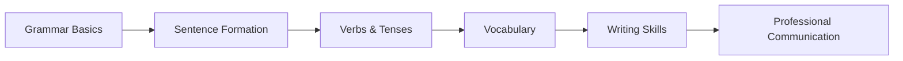

import Tabs from '@theme/Tabs';
import TabItem from '@theme/TabItem';

# Functional English (AEC102)

**Institute:** ICFAI University, Jaipur  
**School:** IcfaiTech  
**Credits:** 2 (L–1 | T–0 | P–2)  

:::info Instructor Information
- **Instructor-in-Charge:** Mr. Raunak Sharma  
- **Email:** raunaks@iujaipur.edu.in  
- **Room:** FST Block 004  
:::

---

## 🎯 Course Objective & Scope

The course focuses on developing **effective English communication skills** required at the undergraduate and professional level.

:::tip Learning Focus
This course balances **grammar fundamentals** with **real-world business communication**.
:::

### Objectives
- Understand the **concept, process, and importance** of communication  
- Gain knowledge of different **media of communication**  
- Develop **written and oral communication skills**  
- Apply communication skills in **business environments**  
- Analyze and overcome **communication barriers**  

---

## 🧠 Learning Outcomes (End of Course)

Students will be able to:

- Improve **comprehension, vocabulary, and grammar**
- Write professional **letters, reports, and applications**
- Demonstrate **verbal & non-verbal communication**
- Apply **critical thinking** in communication scenarios

---

## 🧩 Program Outcomes (POs)

| PO Code | Description |
|------|------------|
| PO1 | Basic mathematical & domain knowledge |
| PO2 | Discipline-specific problem solving |
| PO3 | Experiments and practical application |
| PO4 | Project management & tool usage |
| PO5 | Profession, society & ethics |
| PO6 | Environment & sustainability |
| PO7 | Professional ethics |
| PO8 | Employability & soft skills |
| PO9 | Life-long learning |
| PO10 | Research & critical thinking |

---

## 🎓 Course Outcomes (COs)

| CO | Description |
|----|------------|
| CO1 | Conversational skills in social situations |
| CO2 | Spoken English proficiency |
| CO3 | Scope & importance of English |
| CO4 | Clear and confident presentations |
| CO5 | Adapt communication to diverse audiences |

---

## 🔗 CO–PO Mapping

:::note Interpretation
- **3 = Strong**
- **2 = Medium**
- **1 = Low**
:::

| CO \ PO | PO1 | PO2 | PO3 | PO4 | PO5 | PO6 | PO7 | PO8 | PO9 | PO10 |
|------|----|----|----|----|----|----|----|----|----|----|
| CO1 | 3 | 1 | 1 | 1 | 1 | 1 | 1 | – | – | – |
| CO2 | – | 2 | 2 | – | – | – | – | 2 | – | 3 |
| CO3 | 2 | 1 | – | 2 | 2 | 1 | – | – | 2 | – |
| CO4 | 1 | 1 | – | – | 2 | 1 | – | – | – | – |
| CO5 | 3 | 2 | 1 | – | 3 | – | 1 | – | 2 | 2 |

---

## 🧭 Course Structure Overview

---

📘 Lecture-Wise Teaching Plan

Grammar & Language Foundations

Lectures	Topic	CO

1–3	Sentence types & patterns	CO1
4–5	Tenses & usage	CO1
6–8	Verbs & subject-verb agreement	CO1, CO2
9–10	Vocabulary development	CO1, CO3, CO4

---

Advanced Language Skills

Lectures	Topic	CO

11–13	Phrasal verbs & rearrangement	CO3, CO4
14–15	Noun modifiers & articles	CO3, CO4
16–18	Active & passive voice	CO3, CO4
19–20	Direct & indirect speech	CO2, CO4

---

Applied Communication

Lectures	Topic	CO

21–23	Translation (Hindi ↔ English)	CO1, CO2, CO4
24–25	Idioms & phrases	CO2
26–28	Reading comprehension	CO2
29–31	Letter & application writing	CO1, CO2
32–34	Paragraph, memo, notice writing	CO1, CO3, CO4
35–37	Report & circular writing	CO3, CO4
38–40	Writing skills enhancement	CO3, CO4

---

📝 Evaluation Scheme (Theory)

Component	Duration	Weightage

Mid-Term Exam	1 hr	20%
Lab Exam	2 hrs	30%
Comprehensive Exam	3 hrs	50%

:::warning Exam Policy All exams are closed book unless stated otherwise. :::

---

🔬 Lab Evaluation Breakdown

Component	Weightage

Practical Exam	20%
Practical File	5%
Viva	5%

---

📚 Reference Material

Textbooks

Wren & Martin – H. Martin & P. C. Wren (2023)

English-I – Dr. S. R. Myneni

Reference Books

Business Communication – P.D. Chaturvedi

A Practical English Grammar – Thomson & Martinet

Pit Corder – Intermediate English Grammar

Online Resources

SWAYAM English Course

EnglishClub

Grammarly Blog

---

🕓 Consultation & Policies

:::info Faculty Availability Chamber Consultation:
🕓 4–5 PM, Every Wednesday
:::

Make-Up Policy

Allowed only in genuine cases

Prior approval from Program Coordinator required

---

📌 General Instructions

Assignments must align with current business scenarios

Tests focus on conceptual + problem-solving skills

---

Instructor Signature: Prof. Subhash Sharma
Date: 23-12-2024

---

> This MDX document is production-ready for Docusaurus and optimized for academic documentation.

---
